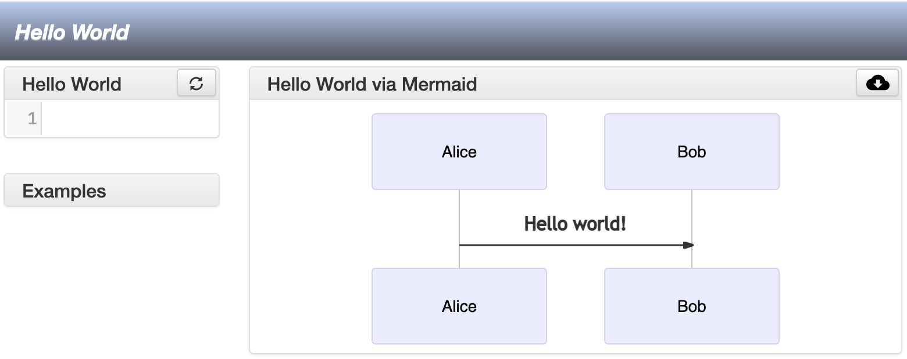

# A [Giter8][g8] template for a new [CAOS][caos] project

**CAOS** is a framework to support **c**omputer **a**ided design of 
structural **o**perational **s**emantics for formal models. 
You can read more about it [here][caos].

**Giter8** is a command line tool to generate files and directories 
from templates published on GitHub or any other git repository, and 
it is integrated with [sbt](https://www.scala-sbt.org).

## Requirements

* Scala building tools ([sbt](https://www.scala-sbt.org))
* Java Runtime Environment ([JRE](https://www.java.com/en/download/))
* Java Development Kit (we recommend [OpenJDK 11](https://openjdk.java.net/projects/jdk/11/))
## Usage

* **Create** a new project with a CAOS template:

```shell
> sbt new arcalab/caos.g8
```
* This will prompt a few questions [with default answers], 
**customise** as desired:

```
A Giter8 template for a CAOS project 

name [CAOS Instance]: 
organization [com.organization]: 
package [com.organization]: 
caos_path [lib/caos]: 
tool_path [site]: 
sbt_version [1.5.2]: 
scala_version [2.13.5]:
```
If everything went well you will see a message similar to the following: 

``` 
Template applied in ./<name>
```
* **Move** into the folder `./<name>`
* **Initiliase** CAOS, by initialising git and adding a new sbt submodule in the same `caos_path` specified above:

```shell
> git init 
> git submodule add https://github.com/arcalab/CAOS.git <caos_path>
```
[g8]: http://www.foundweekends.org/giter8/
[caos]: https://github.com/arcalab/caos

## Hello World 

* **Run** the project by compiling it into JavaScript: 
```shell 
> sbt fastLinkJS
```
* **Open** the file `<tool_path>/index.html` in a web browser. 
If everything went well, you should see a page similar to the following:



The name of the widgets will reflect the configuration of the parameter `name`.

You can open/close a widget by clicking its name (e.g., `Hello World via Mermaid`) 

